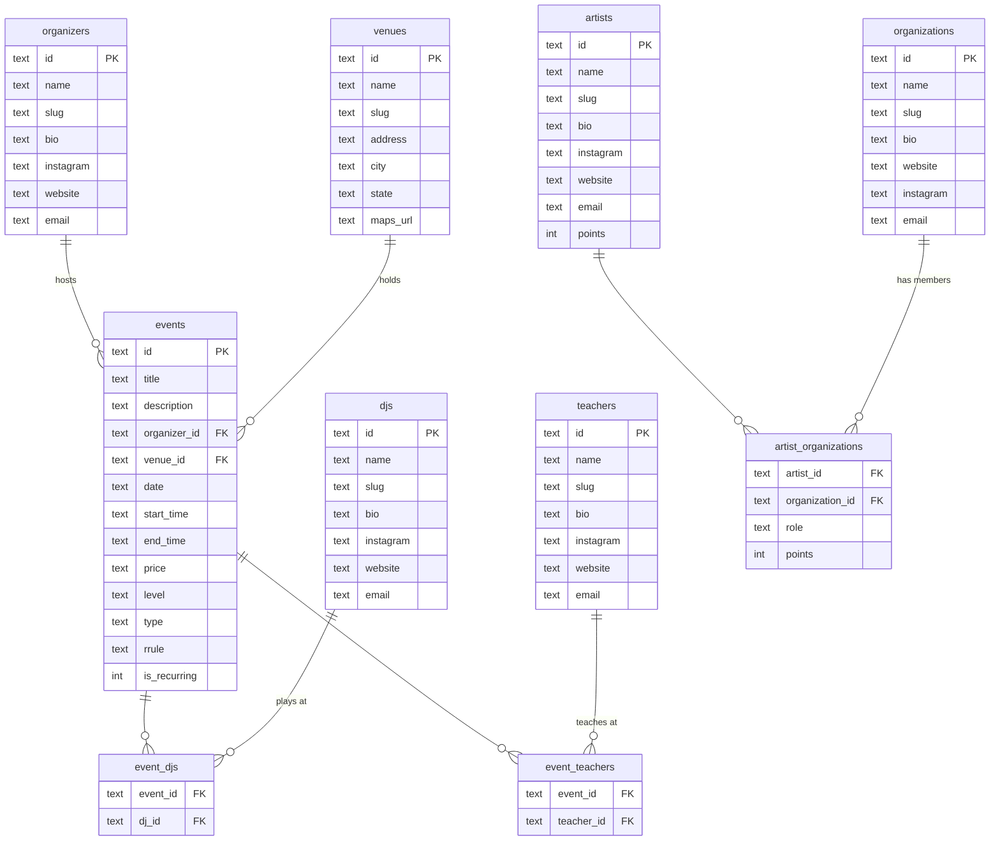

# WCS CMS Schema

## Notes

- **organizers** — the people/groups that run local events (e.g. White Rabbit WCS, Prescott BeatMob)
- **organizations** — governing bodies or regional orgs (e.g. WSDC, regional chapters)
- **djs** — DJs who play at events, linked via `event_djs`
- **teachers** — instructors who teach at events or privately, linked via `event_teachers`
- **artists** — competing dancers; `points` is a running total; `artist_organizations` tracks role + points per org
- **events** — one-time or recurring (RRULE string); linked to one organizer and one venue
