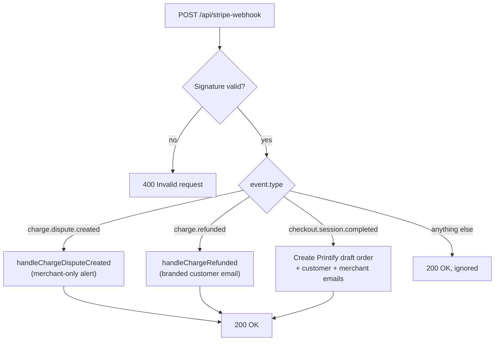
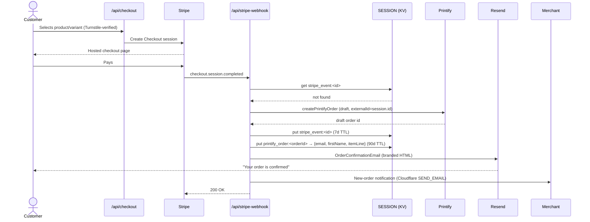
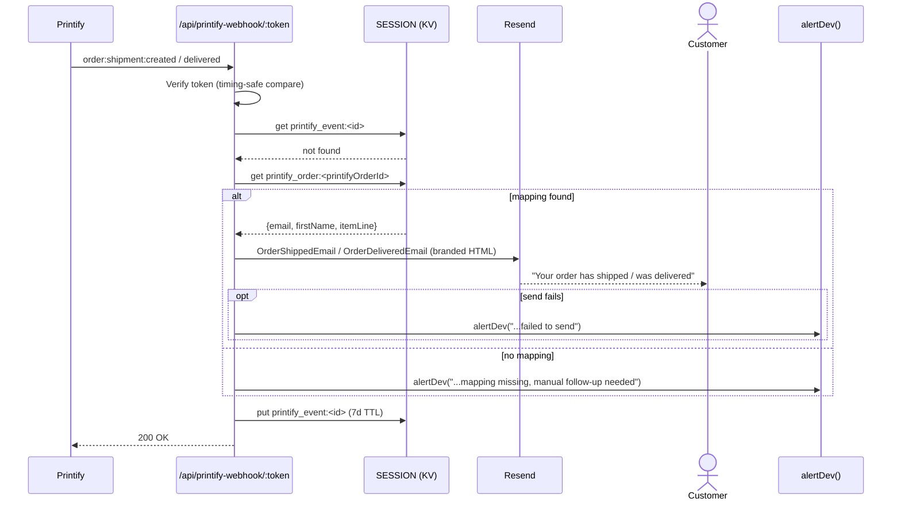
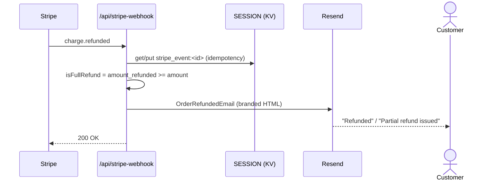
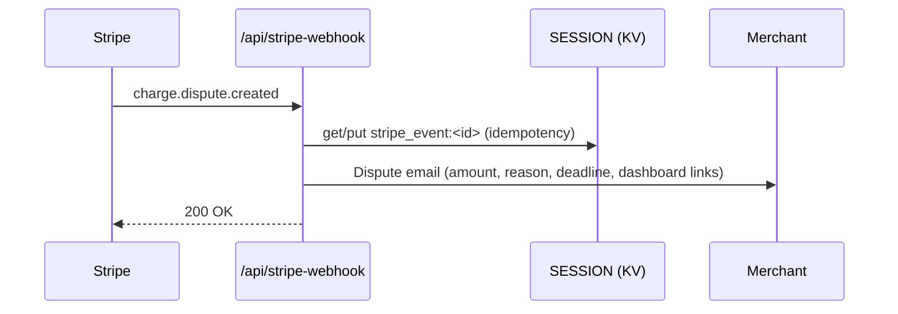

# Shop — Printify + Stripe

Product data is fetched from Printify and committed to `src/data/products.json`. The shop page is entirely static at build time; SSR only activates for `/api/checkout` and `/api/stripe-webhook`.

## Webhook Flows

Two independent webhooks drive the whole customer-email pipeline: Stripe's (`/api/stripe-webhook`, all payment/refund/dispute events) and Printify's (`/api/printify-webhook/[token]`, shipment/delivery events). Neither trusts the other directly — they hand off through the `SESSION` KV namespace, since Printify's shipment payload only carries its own order id, not the customer.

### Stripe event routing

Every Stripe event that reaches the site funnels through one handler, which branches on `event.type` before doing anything else:



### Order confirmation — `checkout.session.completed`



The `printify_order:<orderId>` KV entry written here is the only link between this webhook and the shipment flow below — if that write fails or the KV binding is missing, shipment/delivery emails for that order have nothing to look up later.

### Shipment & delivery notifications — Printify webhook



Printify has no webhook signing scheme, so the `:token` path segment (checked in constant time) plus the KV-lookup gate is the only protection here — an unrecognized order id is just silently ignored rather than trusted.

### Refund confirmation — `charge.refunded`



No merchant notification here — whoever issued the refund (via the Stripe dashboard) already knows.

### Dispute alert — `charge.dispute.created`



Merchant-only, and time-sensitive — Stripe auto-loses undisputed evidence deadlines, and charges a fee regardless of outcome.

## Order Flow

1. Customer selects product/variant → `/api/checkout` creates a Stripe Checkout session
2. Stripe redirects to hosted checkout; on success, fires a webhook to `/api/stripe-webhook`
3. Webhook calls `createPrintifyOrder` in `src/lib/printful.ts`, which creates a **draft** order in Printify
4. Webhook sends the customer an order-confirmation email via Resend, and a new-order notification to `whiterabbitwcs@gmail.com` (both best-effort — failure is logged but doesn't fail the webhook or retry the Printify order)
5. Draft sits in the Printify dashboard for manual review — hit "Send to production" there to fulfill

Printify itself never emails the customer here — this is a custom API integration, not a connected storefront, so Printify only talks to the merchant account. All customer-facing email is this app's responsibility.

Orders are intentionally left as drafts (the `send_to_production` API call is omitted) so each order can be reviewed before Printify charges for fulfillment.

## Shipping/Delivery Notification

Sent from `src/pages/api/printify-webhook/[token].ts` when Printify fires `order:shipment:created` or `order:shipment:delivered` — a separate webhook system from Stripe's, since it's Printify (not Stripe) that knows when something ships.

Printify's shipment payload only carries its own order id, not the customer. `stripe-webhook.ts` stashes `{email, firstName, itemLine}` in KV keyed by `printify_order:<id>` right after creating the Printify order, and this endpoint looks it up when the shipment event arrives (90-day TTL).

**Setup, one-time, outside this repo:**

1. Generate a random token (e.g. `openssl rand -hex 32`) and set it as both a Cloudflare secret and env var for the registration script:
   ```bash
   wrangler secret put PRINTIFY_WEBHOOK_TOKEN
   ```
2. Register the webhooks with Printify (no dashboard UI for this, API only):
   ```bash
   PRINTIFY_API_TOKEN=xxx PRINTIFY_SHOP_ID=xxx PRINTIFY_WEBHOOK_TOKEN=xxx pnpm register-printify-webhooks
   ```
3. Set `DEV_ALERT_EMAIL` as a Cloudflare secret (see Failure alerting below):
   ```bash
   wrangler secret put DEV_ALERT_EMAIL
   ```

**Security note**: Printify's webhook API has no signing/secret scheme (confirmed against their OpenAPI spec — the webhook object is just `{topic, url, shop_id, id}`). The random token in the URL path, checked in constant time, is the only practical protection available; combined with the KV-lookup gate (unrecognized order ids are silently ignored), the realistic worst case of a forged request is negligible.

**Failure alerting**: unlike the order-confirmation email (best-effort, log-only), a shipment/delivery notification that can't be sent — either because the KV order→customer mapping is missing, or because the Resend send itself fails — also calls `alertDev()` (`src/lib/alert.ts`), a small general-purpose "closest thing to Sentry" helper: it emails a developer address via Resend (not the merchant inbox, and not the `SEND_EMAIL` binding, which can only reach that one verified address), since a silently dropped shipment email is easy to miss in Workers logs alone. The destination address is set via the `DEV_ALERT_EMAIL` secret rather than hardcoded, since this repo is public. Without it, alerts fall back to a logged warning instead of failing. `alertDev()` takes the same `env` object every handler already extracts from `locals.runtime.env`, so any other endpoint can call it the same way.

## Security

- `success_url`/`cancel_url` use a hardcoded `SITE_ORIGIN` (the deployed site's own URL) rather than the client-supplied `Origin` header. That header is trivially spoofable and, unvalidated, would let anyone redirect a paying customer to an arbitrary domain after a real Stripe payment completes.
- `/api/checkout` requires a Cloudflare Turnstile token, same as the contact form (`verifyTurnstile` in `src/lib/turnstile.ts`), gated behind `TURNSTILE_SECRET_KEY`. Without it the endpoint could be scripted to generate unlimited Stripe Checkout sessions. If that secret is ever missing in production, `checkout.ts` logs an error immediately rather than silently running with no abuse protection.
- `checkout.ts` logs the real error server-side but returns a generic message to the browser for customer-facing failures — never leak exception text to a customer. `stripe-webhook.ts` is more targeted: the signature-check failure response is reachable by anyone (bots/scanners hit public webhook URLs constantly, and a bad signature usually means the caller isn't really Stripe), so that one stays generic. The Printify-order-creation failure response only fires *after* a verified Stripe signature, so its only audience is Stripe's own retry logic and your webhook dashboard — that one keeps the real error detail, since there's no attacker to withhold it from and it's genuinely useful for debugging from the Stripe side.

## Debugging

`checkout.ts` and `stripe-webhook.ts` log to Cloudflare Workers Logs (`console.log`/`console.error`, viewable in the Cloudflare dashboard or `wrangler tail`). Webhook logs are prefixed `[stripe-webhook] [<stripe event id>]` so every line for one order can be grepped out together; checkout logs are prefixed `[checkout]` and include the Stripe session id, which correlates to the webhook logs for the same order.

## Customer Order-Confirmation Email

Sent from the webhook via [Resend](https://resend.com)'s HTTP API (`sendResendEmail` in `src/lib/email.ts`), gated behind a `RESEND_API_KEY` secret. Chosen over Cloudflare's own Email Service because Cloudflare requires a Workers Paid plan ($5/mo flat) just to send to arbitrary (non-pre-verified) recipients, whereas Resend's free tier — 3,000 emails/month, 100/day — costs $0 and comfortably covers this shop's volume.

Setup (one-time, outside this repo):

1. Sign up at resend.com (free)
2. Add and verify the sending domain (`whiterabbitwcs.com`) — Resend walks you through the SPF/DKIM DNS records
3. Create an API key, then `wrangler secret put RESEND_API_KEY`

## Merchant New-Order Notification

Sent to `whiterabbitwcs@gmail.com` via the same `SEND_EMAIL` Cloudflare binding the contact form uses (`sendEmail` in `src/lib/email.ts`) — no separate setup needed, it's already configured. If order volume ever makes this noisy, filter it on the Gmail side rather than touching the code (the sender is `orders@whiterabbitwcs.com`).

Until `RESEND_API_KEY` is set, `sendResendEmail()` falls back to a `console.log` stub — safe to deploy either way, but customers won't actually receive anything until Resend is configured.

This is separate from the `SEND_EMAIL` binding used by the contact form, which stays on Cloudflare's own Email Routing since it only ever sends to the site's own inbox (free, no plan requirement, no domain onboarding needed — it was already working).

Stripe's own automatic payment-receipt email (Dashboard → Settings → Customer emails → "Successful payments") is a separate, independent toggle and worth enabling too — it's the payment record, not a replacement for the order-confirmation email above.

## Refund Confirmation Email

Sent from the webhook (`handleChargeRefunded` in `stripe-webhook.ts`) when Stripe fires `charge.refunded` — covers both full and partial refunds, and reflects the actual amount refunded (not necessarily the full order total). No merchant notification for this one; whoever issues the refund already knows it happened.

**Requires a manual step**: the Stripe webhook endpoint must be subscribed to the `charge.refunded` event, not just `checkout.session.completed`. Check Stripe Dashboard → Developers → Webhooks → your endpoint → and add it to the selected events if it's not already there, or this code will simply never receive the event.

Recipient email comes from the Charge object (`receipt_email` or `billing_details.email`) rather than looking up the original Checkout Session, so it works even without re-fetching anything — but it also means the email is intentionally generic (doesn't reference which item was refunded), since product/variant metadata isn't reliably available on the Charge object without an extra API round-trip.

## Dispute Notification

Sent to `whiterabbitwcs@gmail.com` (`handleChargeDisputeCreated` in `stripe-webhook.ts`) when Stripe fires `charge.dispute.created`. Disputes are time-sensitive — Stripe auto-loses them if you don't submit evidence by the deadline, and charges a fee regardless of outcome — so the email includes the amount, reason, and response deadline, plus dashboard links to both the dispute and the original charge.

Merchant-only, like the new-order notification — the customer already knows they filed it with their bank, since that's how disputes are initiated (not through this site or Stripe directly).

**Requires the same manual step as the refund email**: the Stripe webhook endpoint must be subscribed to `charge.dispute.created` in Dashboard → Developers → Webhooks → your endpoint, alongside `checkout.session.completed` and `charge.refunded`.

## Testing

**Email copy/design only** — no Stripe, Printify, or Resend involved:

```bash
pnpm preview-email
```

Renders `src/emails/OrderConfirmation.tsx` with a real product from `products.json` and sample shipping data, writes it to `.email-preview.html` (gitignored), and opens it in the browser.

**Full order flow** — checkout → webhook → Printify draft → both emails, with zero real money:

1. Switch to Stripe test mode (Dashboard toggle) and copy the test `sk_test_...` key
2. Run `pnpm dev`, and in another terminal: `stripe listen --forward-to localhost:4321/api/stripe-webhook` — put the printed webhook signing secret and the test secret key in `.dev.vars`
3. Go to `localhost:4321/shop`, buy something, pay with `4242 4242 4242 4242` (any future expiry/CVC)

Printify has no sandbox/test mode, so this still creates a real (draft, free, deletable) order in the actual Printify shop — clean those up afterward. `RESEND_API_KEY` and the Cloudflare `SEND_EMAIL` binding both fall back to a `console.log` stub if unset locally, so leaving them out of `.dev.vars` is a safe way to test the flow without sending real email.

## Payment Model

Stripe and Printify billing are completely separate:

- **Stripe** collects the retail price from the customer and deposits it to the bank account
- **Printify** charges the payment method on file in your Printify account for production + shipping costs

The margin is the spread between the two. Printify has no visibility into what the customer was charged.

To update the Printify payment method: **printify.com → Wallet → Payments**.

## Key Files

| Path | Purpose |
|------|---------|
| `src/pages/shop.astro` | Shop UI — product grid, dialog, variant selectors |
| `src/pages/api/checkout.ts` | Creates Stripe Checkout session |
| `src/pages/api/stripe-webhook.ts` | Handles `checkout.session.completed`, creates Printify order |
| `src/lib/printful.ts` | `createPrintifyOrder` — Printify API wrapper (filename is legacy) |
| `src/lib/email.ts` | `sendResendEmail` (order confirmations, via Resend) and `sendEmail` (contact form, via Cloudflare `send_email` binding) |
| `src/lib/alert.ts` | `alertDev` — best-effort dev-facing ops alert via Resend, for silent failures any endpoint hits |
| `src/data/products.json` | Pre-fetched product catalog (committed; update via fetch script) |

## Refreshing Product Data

```bash
PRINTIFY_API_TOKEN=xxx PRINTIFY_SHOP_ID=xxx node scripts/fetch-products.js
```

## Known Quirk — Swapped color/size Fields

Printify variant titles use different orderings across product types (`"Color / Size"` for tees, `"Size / Color"` for tanks and hats). The fetch script always treats the last segment as size, which gets it wrong for some products.

If `color`/`size` look swapped in `products.json` after a re-fetch, fix them directly in the JSON — the affected products are tank tops and one-size hats (where sizes like `M`/`L` end up in the `color` field).
